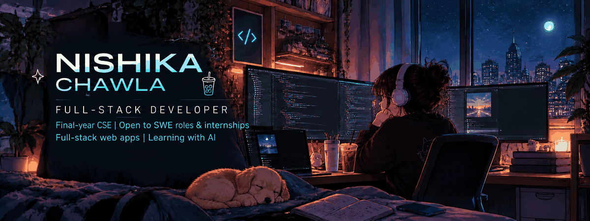

<!-- ========================================================= -->
<!--                 NISHIKA CHAWLA — PROFILE                  -->
<!--        DARK GALAXY • FULL-STACK • APPLIED AI              -->
<!-- ========================================================= -->

<!-- ============================ HERO ============================ -->

  

 

<!-- ======================== SOCIAL BAR ========================== -->

  

  

  

  

 

<!-- ============================================================= -->
<!-- ABOUT                                                         -->
<!-- ============================================================= -->

<!-- CUSTOM ABOUT HEADER WILL GO HERE -->

<h2 align="center">✦ ABOUT ME ✦</h2>

  Computer Science · Full-Stack Development · Applied AI

 

<table>
<tr>

<td width="62%" valign="middle">

### Hi, I'm Nishika.

I'm a **final-year Computer Science Engineering student** focused on building practical, user-facing software.

I work across the stack with **React, Next.js, Node.js and MongoDB**, and I'm exploring **applied AI and computer vision** to build more intelligent products.

I enjoy taking ideas from **concept → implementation → deployment** and continuously improving how I build and ship software.

 

**Open to**

`Software Engineering` · `Full-Stack` · `Internships` · `Full-Time Roles`

</td>

<td width="38%" align="center">

<!-- ABOUT ILLUSTRATION WILL GO HERE -->

[ ABOUT ILLUSTRATION ]

</td>

</tr>
</table>

 

<!-- ============================================================= -->
<!-- TECH STACK                                                    -->
<!-- ============================================================= -->

<!-- CUSTOM STACK HEADER WILL GO HERE -->

<h2 align="center">✦ TECH STACK ✦</h2>

  Technologies I use to design, build and ship.

 

<table>
<tr>

<td width="50%" valign="top">

### Frontend

  

</td>

<td width="50%" valign="top">

### Backend

  

</td>

</tr>

<tr>

<td width="50%" valign="top">

### Databases

  

</td>

<td width="50%" valign="top">

### Mobile

  

</td>

</tr>

<tr>

<td width="50%" valign="top">

### Languages & AI

  

</td>

<td width="50%" valign="top">

### Tools & Platforms

  

</td>

</tr>
</table>

 

  
    Framer Motion · Sanity CMS · REST APIs · SQL · GitHub Actions
  

 

<!-- ============================================================= -->
<!-- FEATURED PROJECTS                                             -->
<!-- ============================================================= -->

<!-- CUSTOM PROJECTS HEADER WILL GO HERE -->

<h2 align="center">✦ FEATURED PROJECTS ✦</h2>

  A selection of things I've built.

 

<!-- PROJECT 01 -->

<table>
<tr>

<td width="68%" valign="middle">

### Pictogram

**Full-Stack Social Platform**

A social networking application focused on authentication, content creation, image uploads and a dynamic feed experience.

 

`React` `Node.js` `Express` `MongoDB`

  

</td>

<td width="32%" align="center">

<!-- PROJECT ILLUSTRATION SLOT -->

[ PROJECT ILLUSTRATION ]

</td>

</tr>
</table>

 

<!-- PROJECT 02 -->

<table>
<tr>

<td width="32%" align="center">

<!-- PROJECT ILLUSTRATION SLOT -->

[ PROJECT ILLUSTRATION ]

</td>

<td width="68%" valign="middle">

### DietLab

**Nutrition Consulting Platform**

A production-oriented platform with reusable UI components, animations and a content publishing workflow for recipes and articles.

 

`Next.js` `React` `Tailwind CSS` `Node.js` `MongoDB`

  

</td>

</tr>
</table>

 

<!-- PROJECT 03 -->

<table>
<tr>

<td width="68%" valign="middle">

### Telemedicine Platform

**Healthcare Application Prototype**

A prototype exploring digital healthcare access through consultations, patient records and supporting healthcare workflows.

 

`React Native` `Expo` `Node.js` `MongoDB`

  

</td>

<td width="32%" align="center">

<!-- PROJECT ILLUSTRATION SLOT -->

[ PROJECT ILLUSTRATION ]

</td>

</tr>
</table>

 

<!-- PROJECT 04 -->

<table>
<tr>

<td width="32%" align="center">

<!-- AI PROJECT ILLUSTRATION SLOT -->

[ AI ILLUSTRATION ]

</td>

<td width="68%" valign="middle">

### AI Traffic Management

**Upcoming Flagship Project**

An AI-based traffic management system exploring vehicle detection, traffic-density analysis and intelligent signal management.

 

`Python` `OpenCV` `YOLO` `Machine Learning`

  

</td>

</tr>
</table>

 

<!-- ============================================================= -->
<!-- EXPERIENCE                                                    -->
<!-- ============================================================= -->

<!-- CUSTOM EXPERIENCE HEADER WILL GO HERE -->

<h2 align="center">✦ EXPERIENCE ✦</h2>

  Professional development experience.

 

<table>
<tr>

<td width="75%" valign="middle">

### Web Development Intern — DietLab

`Remote` · `Dec 2025 — Jun 2026`

- Built and maintained a responsive nutrition consulting platform with reusable components and interactive sections.
- Developed a recipe and blog publishing workflow for independent content management.
- Contributed across frontend development, backend integration and content management.

`Next.js` `React` `Tailwind CSS` `Framer Motion` `Node.js` `MongoDB`

</td>

<td width="25%" align="center">

<!-- EXPERIENCE ILLUSTRATION SLOT -->

[ EXPERIENCE ILLUSTRATION ]

</td>

</tr>

<tr>

<td width="25%" align="center">

<!-- EXPERIENCE ILLUSTRATION SLOT -->

[ EXPERIENCE ILLUSTRATION ]

</td>

<td width="75%" valign="middle">

### Web Development Intern — FootFlex

`Remote` · `Oct 2025 — Dec 2025`

- Built a responsive B2B marketing website for a Dubai-based startup.
- Developed product and category experiences with search and lead-generation workflows.
- Contributed to internal tools for managing product and inquiry information.

`Next.js` `React` `Tailwind CSS` `Node.js` `MongoDB`

</td>

</tr>
</table>

 

<!-- ============================================================= -->
<!-- DEVELOPER ACTIVITY                                            -->
<!-- ============================================================= -->

<!-- CUSTOM ACTIVITY HEADER WILL GO HERE -->

<h2 align="center">✦ DEVELOPER ACTIVITY ✦</h2>

  A snapshot of my GitHub activity.

 

 

<!-- CONTRIBUTION SNAKE WILL BE ADDED LATER -->

[ CONTRIBUTION ACTIVITY ]

 

<!-- ============================================================= -->
<!-- CURRENTLY LEARNING                                            -->
<!-- ============================================================= -->

<h2 align="center">✦ CURRENTLY LEARNING ✦</h2>

  Areas I'm actively exploring.

 

<table>
<tr>

<td width="72%" valign="middle">

### Exploring next

`Applied AI` · `Computer Vision` · `System Design` · `Production Engineering`

 

Building toward software that is not only functional, but **reliable, scalable and genuinely useful.**

</td>

<td width="28%" align="center">

<!-- LEARNING ILLUSTRATION SLOT -->

[ GALAXY / LEARNING ILLUSTRATION ]

</td>

</tr>
</table>

 

<!-- ============================================================= -->
<!-- CONNECT                                                       -->
<!-- ============================================================= -->

<!-- CUSTOM CONNECT HEADER WILL GO HERE -->

<h2 align="center">✦ LET'S CONNECT ✦</h2>

 

<table>
<tr>

<td width="35%" align="center">

<!-- CLOSING ILLUSTRATION SLOT -->

[ CONNECT ILLUSTRATION ]

</td>

<td width="65%" valign="middle">

### Have an interesting problem to solve?

I'm always open to connecting with **developers, founders, teams and recruiters** working on interesting products.

 

</td>

</tr>
</table>

 

  ✦ Build · Learn · Ship ✦

